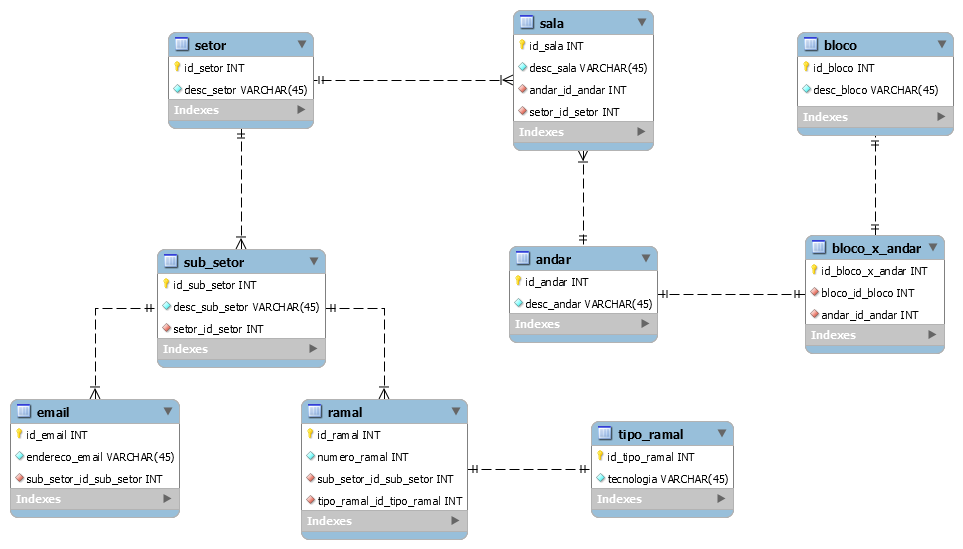

# Cad Ramais 

Participação na elaboração do MR (Modelo Relacional) e BD MySQL do Cad Ramais, novo sistema de controle de ramais, desenvolvido no Scriptcase por Victor Monte, supervisor de estágio da Equipe de Desenvolvimento no Depart. de Gestão de Tecnologia da Informação (DGTI) do IFPE campus Recife.

## Necessidade

Há anos existe um sistema de ramais para que os servidores do IFPE possam cadastrar e consultar os ramais dos setores do campus Recife. Porém o sistema existente não obedece algumas das regras de normalização, não permite atualização dos dados nem a exclusão de ramais. Desta forma, muito ramais ou setores a eles relacionados, quando cadastrado erroneamente eram cadastrados novamente, gerando duplicidade e dúvidas acerca da veracidade da informação.

Um novo sistema de ramais está sendo desenvolvido para tornar-se flexível às alterações futuras e atender as normalizações que um BD exige.

## Modelo Relacional (MR)



## Script MySQL

Criação do BD.
```mysql
CREATE DATABASE cad_ramais;
```

Criação das tabelas com seus respectivos campos.
```mysql
CREATE TABLE bloco(
id_bloco INT,
desc_bloco VARCHAR(45) NOT NULL,
PRIMARY KEY(id_bloco)
);

CREATE TABLE andar(
id_andar INT,
desc_andar VARCHAR(45) NOT NULL,
PRIMARY KEY(id_andar)
);

CREATE TABLE bloco_x_andar(
id_bloco_x_andar INT,
id_bloco INT,
id_andar INT,
PRIMARY KEY(id_bloco_x_andar),
FOREIGN KEY (id_bloco) REFERENCES bloco (id_bloco),
FOREIGN KEY (id_andar) REFERENCES andar (id_andar)
);

CREATE TABLE setor(
id_setor INT,
desc_setor VARCHAR(45) NOT NULL,
PRIMARY KEY(id_setor)
);

CREATE TABLE sala(
id_sala INT,
desc_sala VARCHAR(45) NOT NULL,
id_andar INT,
id_setor INT,
PRIMARY KEY(id_sala),
FOREIGN KEY (id_andar) REFERENCES andar (id_andar),
FOREIGN KEY (id_setor) REFERENCES setor (id_setor)
);

CREATE TABLE sub_setor(
id_sub_setor INT,
desc_sub_setor VARCHAR(45) NOT NULL,
id_setor INT,
PRIMARY KEY(id_sub_setor),
FOREIGN KEY (id_setor) REFERENCES setor (id_setor)
);

CREATE TABLE email(
id_email INT,
endereco_email VARCHAR(45) NOT NULL,
id_sub_setor INT,
PRIMARY KEY(id_email),
FOREIGN KEY (id_sub_setor) REFERENCES sub_setor (id_sub_setor)
);

CREATE TABLE tipo_ramal(
id_tipo_ramal INT,
tecnologia VARCHAR(45) NOT NULL,
PRIMARY KEY(id_tipo_ramal)
);

CREATE TABLE ramal(
id_ramal INT,
numero_ramal INT NOT NULL,
id_sub_setor INT,
id_tipo_ramal INT,
PRIMARY KEY(id_ramal),
FOREIGN KEY (id_sub_setor) REFERENCES sub_setor (id_sub_setor),
FOREIGN KEY (id_tipo_ramal) REFERENCES tipo_ramal (id_tipo_ramal)
);
```

Exclusão das tabelas.
```mysql
DROP TABLE ramal;
DROP TABLE tipo_ramal;
DROP TABLE email;
DROP TABLE sub_setor;
DROP TABLE sala;
DROP TABLE setor;
DROP TABLE bloco_x_andar;
DROP TABLE andar;
DROP TABLE bloco;
```

Exclusão do BD
```mysql
DROP DATABASE cad_ramais;
```
